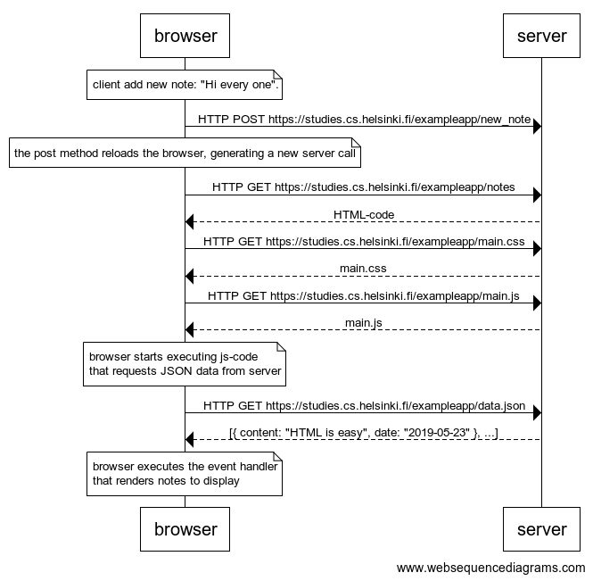

# **Full Stack Open 2022**

Este repositorio está hecho para agregar las soluciones a los diferentes retos impuestos por el Bootcamp Full Stack Open 2022

## **Content**

## **Temas**

### **Part 0**

#### 0.1: HTML

Revise los conceptos básicos de HTML leyendo este tutorial de Mozilla: [tutorial HTML.](https://developer.mozilla.org/es/docs/Learn/Getting_started_with_the_web/HTML_basics) _Este ejercicio no se envía a GitHub, basta con leer el tutorial_

#### 0.2: CSS

Revise los conceptos básicos de CSS leyendo este tutorial de Mozilla: [tutorial CSS.](https://developer.mozilla.org/es/docs/Learn/Getting_started_with_the_web/CSS_basics) _Este ejercicio no se envía a GitHub, basta con leer el tutorial_

#### 0.3: Formularios HTML

Aprende sobre los conceptos básicos de los formularios HTML leyendo el tutorial de Mozilla [Tu primer formulario.](https://developer.mozilla.org/es/docs/Learn/Forms/Your_first_form) _Este ejercicio no se envía a GitHub, basta con leer el tutorial_

#### 0.4: Nueva nota

Crear un diagrama similar que describa la situación en la que el usuario crea una nueva nota en la página [https://studies.cs.helsinki.fi/exampleapp/notes](https://studies.cs.helsinki.fi/exampleapp/notes) escribiendo algo en el campo de texto y haciendo clic en el botón submit.

#### 0.5: Aplicación de una sola página

#### 0.6: Nueva nota

### **Part 1**

### **Part 2**

### **Part 3**

### **Part 4**

### **Part 5**

### **Part 6**

### **Part 7**

### **Part 8**

### **Part 9**

### **Part 10**

### **Part 11**

### **Part 12**

## **Contacto**

## **Licencia**
