# **Full Stack Open 2022**

Este repositorio está hecho para agregar las soluciones a los diferentes retos impuestos por el Bootcamp Full Stack Open 2022

## **Contenido**

- [**Full Stack Open 2022**](#full-stack-open-2022)
  - [**Contenido**](#contenido)
  - [**Temas**](#temas)
    - [**Part 0: Fundamentos de las aplicaciones web**](#part-0-fundamentos-de-las-aplicaciones-web)
      - [0.1: HTML](#01-html)
      - [0.2: CSS](#02-css)
      - [0.3: Formularios HTML](#03-formularios-html)
      - [0.4: Nueva nota](#04-nueva-nota)
      - [0.5: Aplicación de una sola página](#05-aplicación-de-una-sola-página)
      - [0.6: Nueva nota spa](#06-nueva-nota-spa)
    - [**Part 1A: Introducción a react**](#part-1a-introducción-a-react)
      - [1.1: información del curso, paso 1](#11-información-del-curso-paso-1)
      - [1.2: información del curso, paso 2](#12-información-del-curso-paso-2)
    - [**Part 1B: JavaScript**](#part-1b-javascript)
      - [1.3: información del curso, paso 3](#13-información-del-curso-paso-3)
      - [1.4: información del curso paso 4](#14-información-del-curso-paso-4)
      - [1.5: información del curso paso 5](#15-información-del-curso-paso-5)
    - [**Part 1C: Estado del componente, controladores de eventos**](#part-1c-estado-del-componente-controladores-de-eventos)
      - [1.6: unicafe, paso 1](#16-unicafe-paso-1)
      - [1.7: unicafe, paso 2](#17-unicafe-paso-2)
      - [1.8: unicafe, paso 3](#18-unicafe-paso-3)
      - [1.9: unicafe, paso 4](#19-unicafe-paso-4)
      - [1.10: unicafe, paso 5](#110-unicafe-paso-5)
      - [1.11: unicafe, paso 6](#111-unicafe-paso-6)
    - [**Part 1D: Un estado más complejo, depurando aplicaciones React**](#part-1d-un-estado-más-complejo-depurando-aplicaciones-react)
      - [1.12: anécdotes, paso 1](#112-anécdotes-paso-1)
      - [1.13: anécdotes, paso 2](#113-anécdotes-paso-2)
      - [1.14: anécdotes, paso 3](#114-anécdotes-paso-3)
    - [**Part 2**](#part-2)
    - [**Part 3**](#part-3)
    - [**Part 4**](#part-4)
    - [**Part 5**](#part-5)
    - [**Part 6**](#part-6)
    - [**Part 7**](#part-7)
    - [**Part 8**](#part-8)
    - [**Part 9**](#part-9)
    - [**Part 10**](#part-10)
    - [**Part 11**](#part-11)
    - [**Part 12**](#part-12)
  - [**Contacto**](#contacto)
  - [**Licencia**](#licencia)

## **Temas**

### **Part 0: Fundamentos de las aplicaciones web**

#### 0.1: HTML

Revise los conceptos básicos de HTML leyendo este tutorial de Mozilla: [tutorial HTML.](https://developer.mozilla.org/es/docs/Learn/Getting_started_with_the_web/HTML_basics) _Este ejercicio no se envía a GitHub, basta con leer el tutorial_

#### 0.2: CSS

Revise los conceptos básicos de CSS leyendo este tutorial de Mozilla: [tutorial CSS.](https://developer.mozilla.org/es/docs/Learn/Getting_started_with_the_web/CSS_basics) _Este ejercicio no se envía a GitHub, basta con leer el tutorial_

#### 0.3: Formularios HTML

Aprende sobre los conceptos básicos de los formularios HTML leyendo el tutorial de Mozilla [Tu primer formulario.](https://developer.mozilla.org/es/docs/Learn/Forms/Your_first_form) _Este ejercicio no se envía a GitHub, basta con leer el tutorial_

#### 0.4: Nueva nota

Crear un diagrama similar que describa la situación en la que el usuario crea una nueva nota en la página [https://studies.cs.helsinki.fi/exampleapp/notes](https://studies.cs.helsinki.fi/exampleapp/notes) escribiendo algo en el campo de texto y haciendo clic en el botón submit.

- usuario rellena el input y se enviá la información mediante un botón llamado "save".
- el navegador envía una solicitud post con la información del formulario a la dirección "exampleapp/new_note".
- el servidor guarda la información recibida.
- el evento submit recarga el navegador realizando una nueva petición al servidor, cargado los archivos notes, main.css y main.js.

```json
note over browser:
client add new note: "Hi every one"
end note
browser->server: HTTP POST https://studies.cs.helsinki.fi/exampleapp/new_note

note over server:
server save a new note
end note

note over browser:
the POST method reloads browser, generating a new server call
end note

browser->server: HTTP GET https://studies.cs.helsinki.fi/exampleapp/notes
server-->browser: HTML-code
browser->server: HTTP GET https://studies.cs.helsinki.fi/exampleapp/main.css
server-->browser: main.css
browser->server: HTTP GET https://studies.cs.helsinki.fi/exampleapp/main.js
server-->browser: main.js

note over browser:
browser starts executing js-code
that requests JSON data from server
end note

browser->server: HTTP GET https://studies.cs.helsinki.fi/exampleapp/data.json
server-->browser: [{ content: "HTML is easy", date: "2019-05-23" }, ...]

note over browser:
browser executes the event handler
that renders notes to display
end note
```


#### 0.5: Aplicación de una sola página

Cree un diagrama que describa la situación en la que el usuario accede a la versión de aplicación de una sola página de la aplicación de notas en [https://studies.cs.helsinki.fi/exampleapp/spa](https://studies.cs.helsinki.fi/exampleapp/spa).

- al realizar una petición el navegador carga el archivo spa y quien tiene la estructura html.
- dentro de la estructura html se encuentra la petición main.css y spa.js.
- dentro del código de spa.js se encuentra una petición a "https://studies.cs.helsinki.fi/exampleapp/data.json", retornando el archivo data.json
- el navegador renderiza los datos en el html.

```json
browser->server: HTTP GET https://studies.cs.helsinki.fi/exampleapp/spa
server-->browser: HTML-code
browser->server: HTTP GET https://studies.cs.helsinki.fi/exampleapp/main.css
server-->browser: main.css
browser->server: HTTP GET https://studies.cs.helsinki.fi/exampleapp/spa.js
server-->browser: spa.js

note over browser:
browser starts executing js-code
that requests JSON data from server
end note

browser->server: HTTP GET https://studies.cs.helsinki.fi/exampleapp/data.json
server-->browser: [{" content":"make american great again!","date":"2022-05-10T14:31:13.201Z"}...]

note over browser:
browser executes the event handler
that renders notes to display
end note
```


#### 0.6: Nueva nota spa

Cree un diagrama que represente la situación en la que el usuario crea una nueva nota utilizando la versión de una sola página de la aplicación.

- usuario rellena el input y se enviá la información mediante un botón llamado "save".
- el navegador renderiza la nueva nota sin recargarse, esta es una propiedad que tiene las spa.
- el navegador enviá una solicitud post con la información del formulario a la dirección "exampleapp/new_note_spa".
- el servidor guarda la información recibida.
- el servidor retorna un mensaje de repuesta "note created".

```json
note over browser:
spa.js add a new note in notes array, then added to the <ul> node
end note

browser->server: HTTP POST https://studies.cs.helsinki.fi/exampleapp/spa
server-->browser: {"message":"note created"}
```

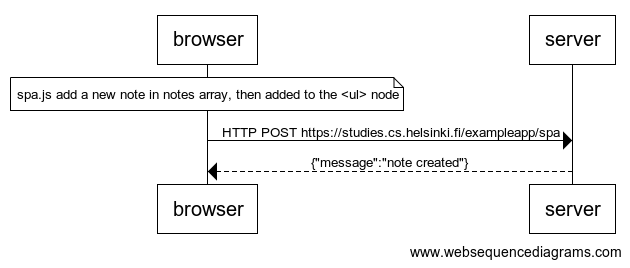

### **Part 1A: Introducción a react**

#### 1.1: información del curso, paso 1

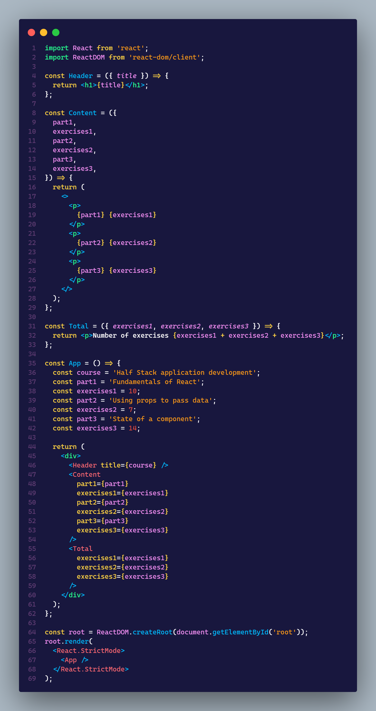

#### 1.2: información del curso, paso 2

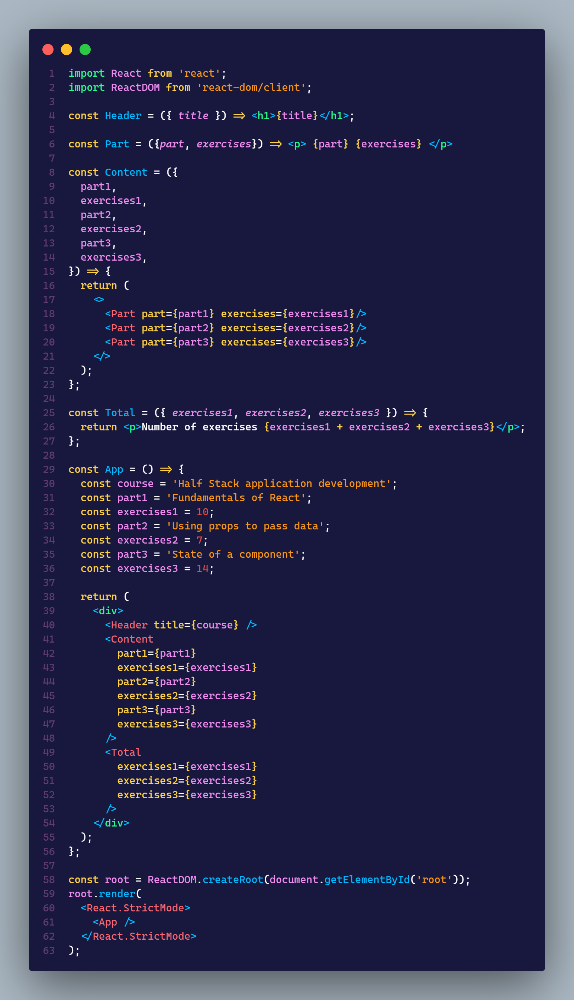

### **Part 1B: JavaScript**

#### 1.3: información del curso, paso 3

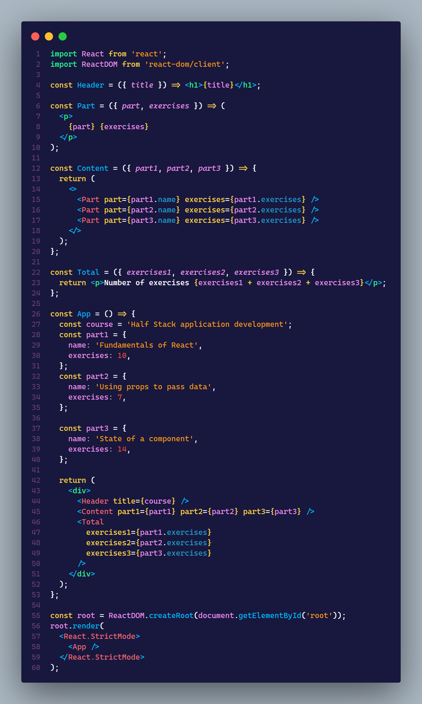

#### 1.4: información del curso paso 4

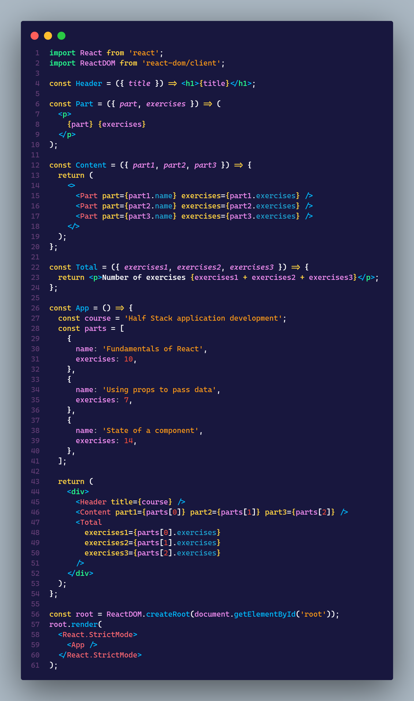

#### 1.5: información del curso paso 5

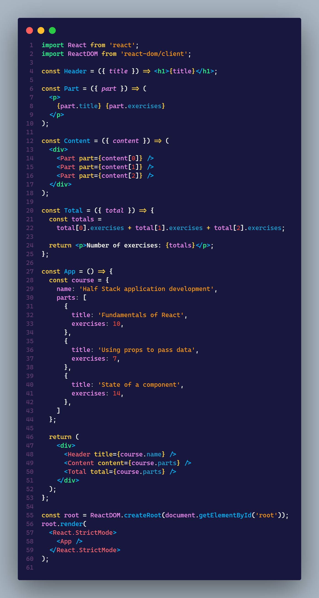

Solución para [**courseinfo**](https://github.com/Mooenz/full-stack-open-2022/tree/main/part-1/courseinfo)

### **Part 1C: Estado del componente, controladores de eventos**

#### 1.6: unicafe, paso 1


#### 1.7: unicafe, paso 2

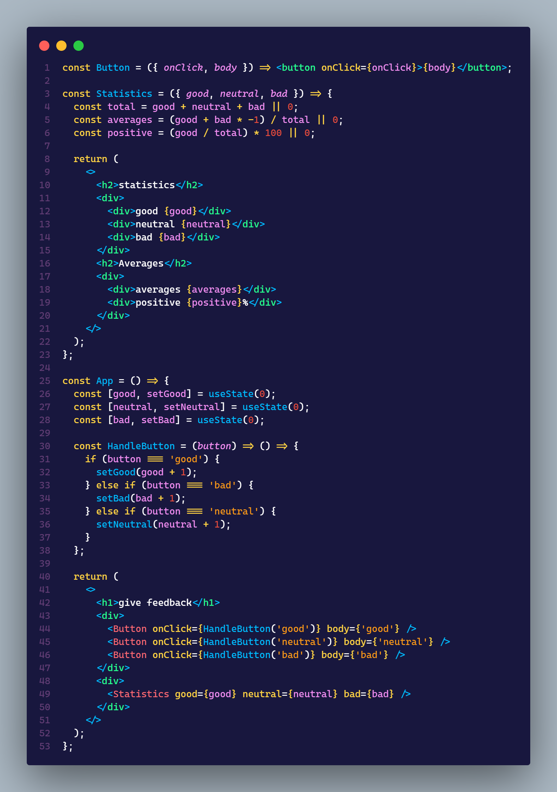

#### 1.8: unicafe, paso 3

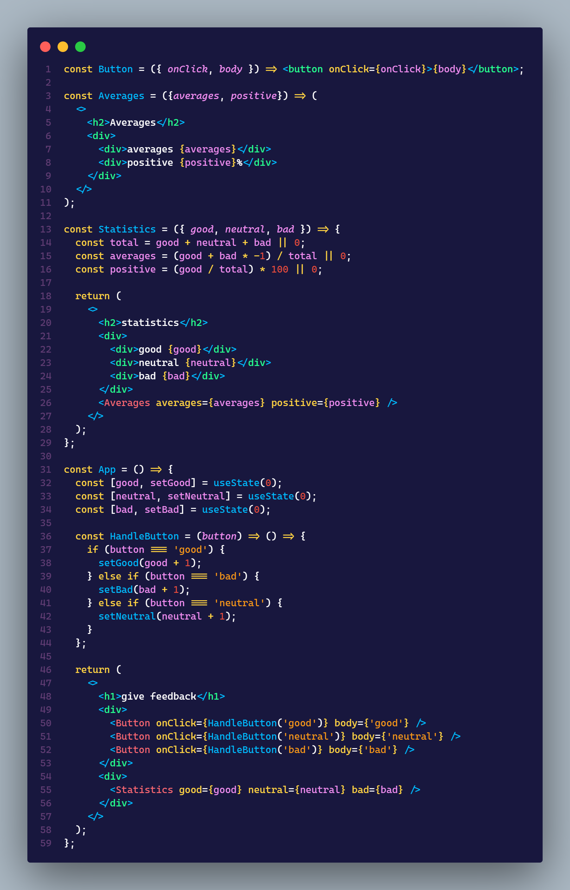

#### 1.9: unicafe, paso 4

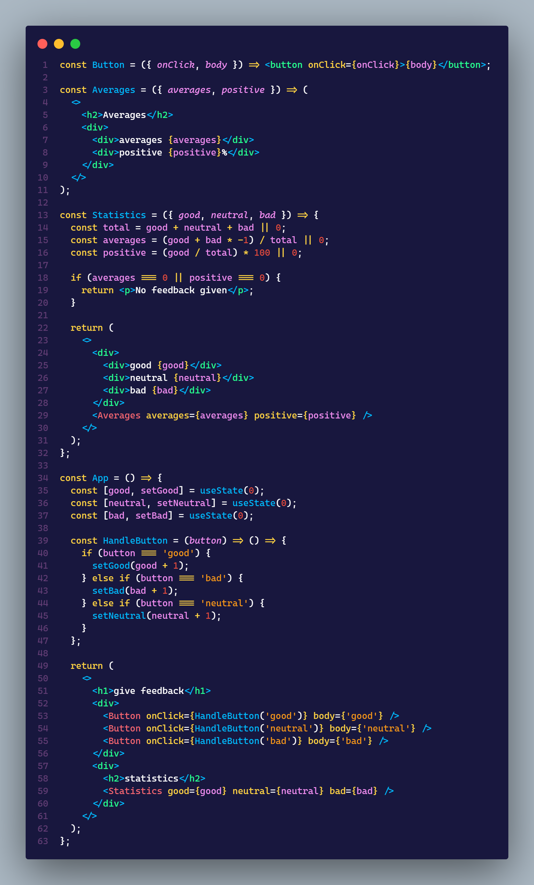

#### 1.10: unicafe, paso 5

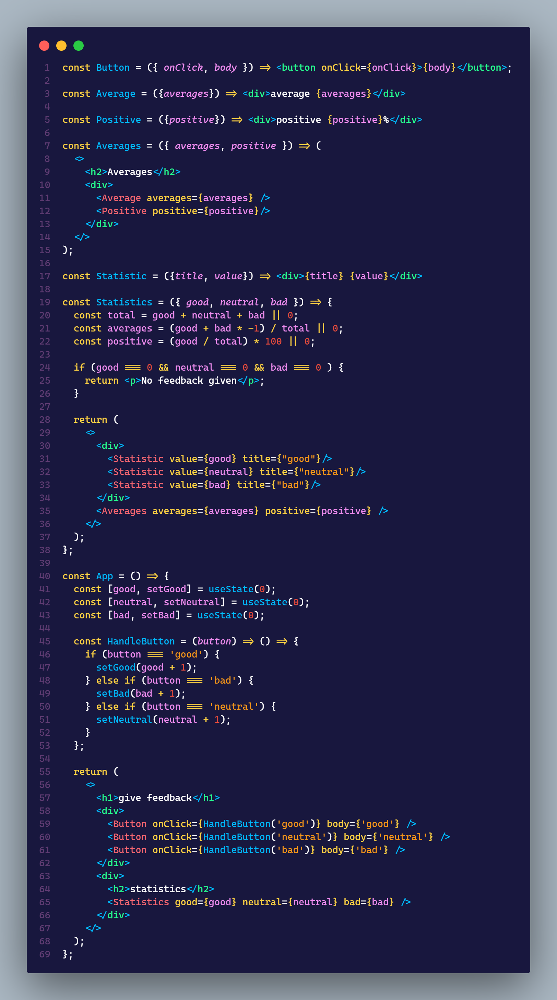

#### 1.11: unicafe, paso 6

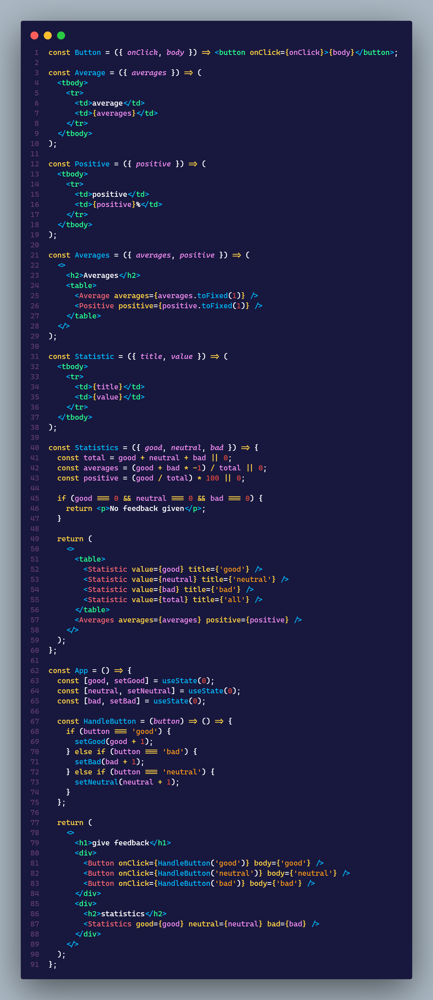

### **Part 1D: Un estado más complejo, depurando aplicaciones React**

#### 1.12: anécdotes, paso 1

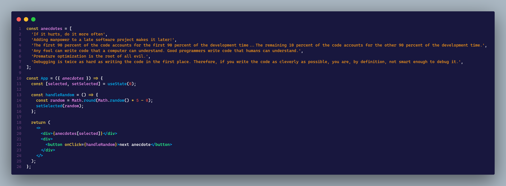

#### 1.13: anécdotes, paso 2

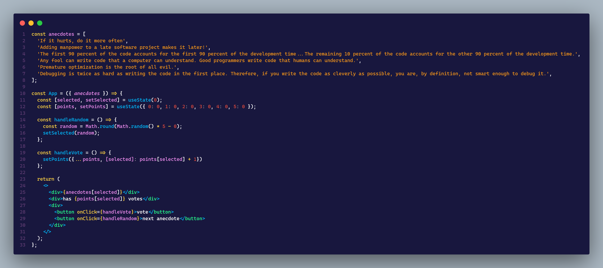

#### 1.14: anécdotes, paso 3

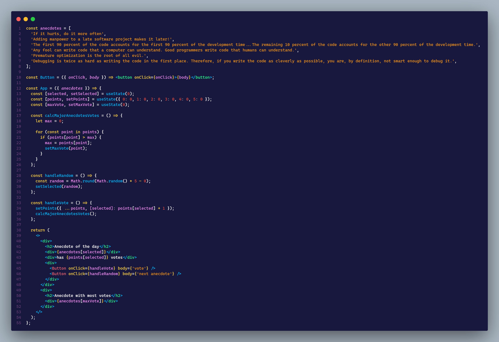

### **Part 2**

### **Part 3**

### **Part 4**

### **Part 5**

### **Part 6**

### **Part 7**

### **Part 8**

### **Part 9**

### **Part 10**

### **Part 11**

### **Part 12**

## **Contacto**

## **Licencia**
